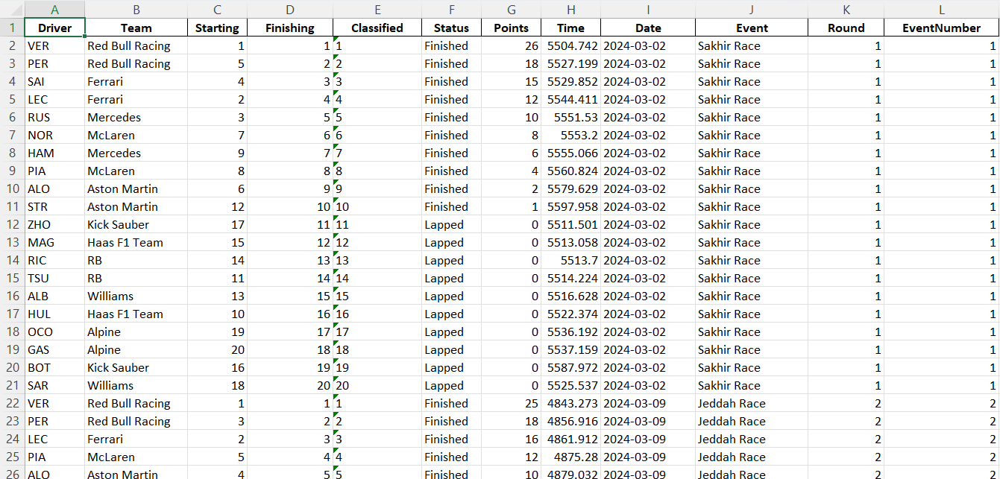

# f1dataexcel
F1DataExcel is a Python command-line utility for downloading Formula 1 session data as an excel and csv file using [FastF1](https://theoehrly.github.io/Fast-F1/). It supports structured workflows and integrates `argparse` to provide a user-friendly CLI.



## Installation
### 1. Clone the repository
```bash
git clone https://github.com/rsatapat/f1dataexcel.git
cd f1dataexcel
```
### 2. Create a Conda environment
```bash
conda env create -f environment.yml
conda activate f1dataexcel
```
### 3. (Optional) Install as a CLI command
If you want to use f1dataexcel as a global command in your environment:
```bash
pip install -e .
```
The `-e` flag stands for editable which means that any changed you made to the source code come into effect immediately, without the need for re-installation.
### Basic syntax
Without installation
```bash
python -m f1dataexcel 2024 -d path/to/folder
```
With installation
```bash
f1dataexcel 2024 -d path/to/folder
```

### If you want to install data for just one event
```bash
f1dataexcel 2024 -d path/to/folder -e Japan
```
OR
```bash
f1dataexcel 2024 -d path/to/folder -e Suzuka
```
Try to spell the name of the event as close to the correct spelling as possible, both the name of the country or the name of the track work, as shown in the examples above.

### Disabling FastF1 Cache (Optional)
```bash
f1dataexcel 2024 -d path/to/folder --no-cache
```
Disabling the cache causes the data to get downloaded again. With cache enabled, the default, fastf1 looks if data is already present in the directory.
